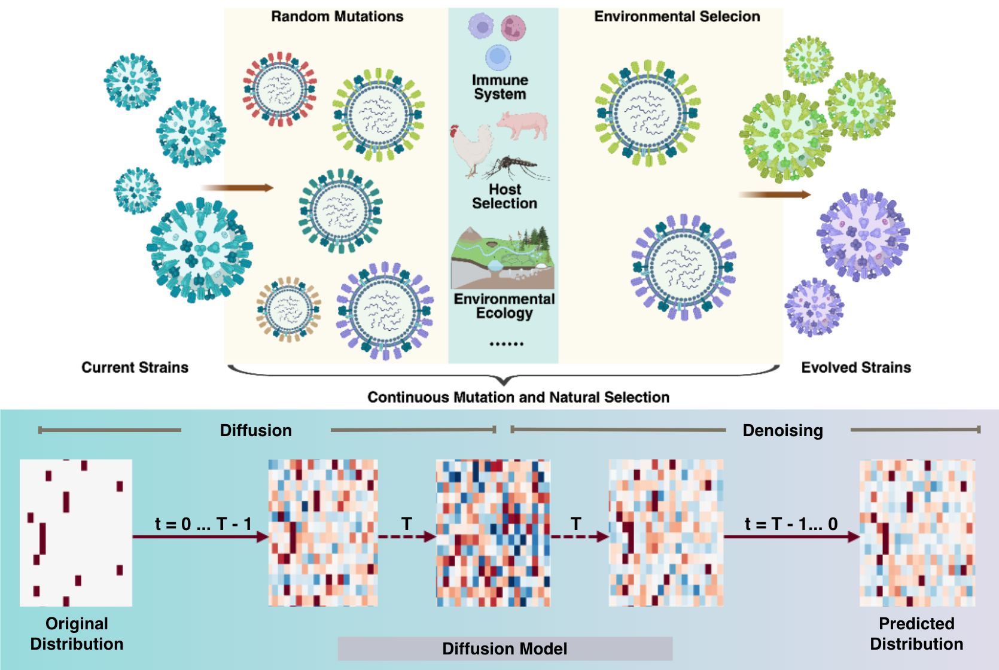

# A diffusion model of viral evolution predicts mutation fitness and evolutionary trajectories

> Viral Evolution Simulator (VES), a diffusion model-based framework that mirrors the duality of viral evolution by design: forward noise injection simulates stochastic mutation, and reverse denoising recapitulates selective filtering.

  
   
  <em> Modelling viral evolution via diffusion models </em>

## 📌 Summary

This is the official implementation for the paper "A diffusion model of viral evolution predicts mutation fitness and evolutionary trajectories". We propose VES, a viral evolution simulator based on diffusion model to learn the viral evolution patterns and predict potential mutations that may increase the fitness of viruses in nature and bring health threat to human beings. 

The training and evaluation steps are provided in this repository, with data and model checkpoints uploaded to Zenodo. Quantitative evaluation results can be found at "sampled_evaluation" folder, and model predictions for detailed analysis with more experimental data are uploaded at "results/model_prediction_with_exp_data" for your reference. 

During implementation, we referenced the code from [EVEscape](https://github.com/OATML-Markslab/EVEscape) and [EVE](https://github.com/OATML-Markslab/EVE) regarding data loading, mutation generation, and quantification calculations, making adjustments and modifications tailored to our work and carrying out more evaluation regarding viral evolution simulation and prediction.

Please cite our paper as below if you find the research and code useful:

## 🛠️ Core Requirements
torch 2.8.0+cu128

numpy==2.3.2

pandas==2.3.3

scikit-learn==1.7.2

scipy==1.17.1

biopython==1.85

## 📂 Datasets
### Training Data
- **Source**：GISAID
- **Volume**：95,560 sequences for influenza virus (hemagglutinin protein); 55,246 sequences for SARS-CoV-2 viruses (spike protein)
- **Pre-processing**：quality control and 100% redundancy removal
- **Alignment**：multiple sequence alignment using MAFFT, selecting the Influenza A virus (A/WSN/1933(H1N1)) strain and the hCoV-19/Wuhan/WIV04/2019 (WIV04) strain of SARS-CoV-2 viruses as the wild type reference sequences for the respective alignments

### Evaluation Data
- **Source**：
1. How single mutations affect viral escape from broad and narrow antibodies to H1 influenza hemagglutinin

2. Accurate Measurement of the Effects of All Amino-Acid Mutations on Influenza Hemagglutinin

3. Complete mapping of viral escape from neutralizing antibodies

4. Deep mutational scanning of H5 hemagglutinin to inform influenza virus surveillance

## 🚀 Training
| Parameter | Value |
|------|------|
| Batch size | 1024 |
| Learning rate | 1e-4 |
| Epochs | 60 |
| Optimizer | AdamW |
| Hardware | single NVIDIA GeForce RTX 5090 GPU |

